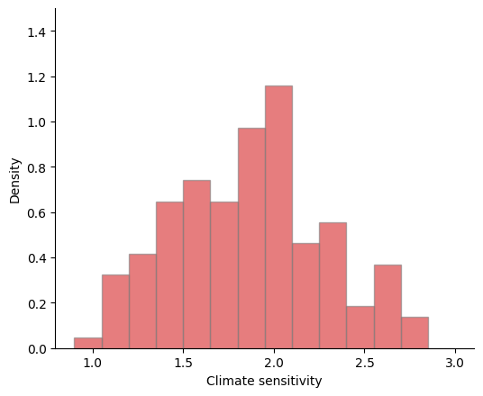

2 Uncertain climate dynamics
============================

2.1 Simple approximation to climate dynamics
--------------------------------------------

We use exponentially weighted average of each of response functions as
coefficients :math:`\{\theta_\ell\}_{\ell=1}^L` in our computations. The
discount rate :math:`\delta=0.01`.

The histogram of those coefficients are represented below:

.. code:: ipython3

    # packages
    import numpy as np
    import pandas as pd
    import matplotlib.pyplot as plt
    import matplotlib as mpl
    mpl.rcParams['axes.spines.right'] = False
    mpl.rcParams['axes.spines.top'] = False
    mpl.rcParams['legend.frameon'] = False
    # climate sensitivity histogram
    θ_list = pd.read_csv('data/model144.csv', header=None).to_numpy()[:, 0]/1000. 
    plt.figure(figsize=(6,5), dpi=100)
    plt.hist(θ_list*1000, bins=13, density=True, color="salmon", ec="gray")
    plt.xlabel("Climate sensitivity")
    plt.ylabel("Density")
    plt.show()

.. _histogram:

   Exponential average of 144 response functions.

2.2 Stochastic climate pulses
-----------------------------

To explore uncertainty, we introduce explicit stochasticity as a
precursor to the study of uncertainty. We capture this randomness in
part by an exogenous forcing processes that evolves as:

.. math::

   dZ_t = \mu_z(Z_t) dt + \sigma_z(Z_t) dW_t

where :math:`\{ W_t : t \ge 0\}` a multivariate standard Brownian
motion. We partition the vector Brownian motion into two subvectors as
follows:

.. math::

   dW_t = \begin{bmatrix} dW_t^y \cr dW_t^k \end{bmatrix}

where the first component consists of the climate change shocks and the
second component contains the technology shocks. Consider an emissions
“pulse” of the form

.. math::

   \left(\iota_y \cdot Z_t \right) {\mathcal E}_t  \left( \theta dt + \varsigma \cdot dW_t^y\right)

| where :math:`{\mathcal E}_t` is fossil fuel emissions and
  :math:`\iota_y \cdot Z = \{ \iota_y \cdot Z_t : t\ge 0\}` is a
  positive process which we normalize to have mean one. The
  :math:`\iota_y\cdot Z`-process captures “left out” components of the
  climate system’s reaction to an emission of :math:`{\mathcal E}_t`
  gigatons into the atmosphere while the :math:`\varsigma \cdot dW`
  process captures short time scale fluctuations.
| We will use a positive Feller square root process for the
  :math:`\iota_y\cdot Z` process in our analysis.

Within this framework, we impose the “Matthews’ approximation” by making
the consequence of the pulse permanent:

.. math::

    dY_t = \mu_y(Z_t, {\mathcal E}_t) dt + \sigma_y(Z_t, {\mathcal E}_t) dW_t^y

where

.. math::

   \begin{align*}
   \mu_y(z, e) & =  e \left(\iota_y \cdot z \right) \theta   \cr
   \sigma_y(z, e) & = e \left(\iota_y \cdot z \right) \varsigma'
   \end{align*}

Throughout, we will use uppercase letters to denote random vector or
stochastic processes and lower case letters to denote possible
realizations. Armed with this “Matthews’ approximation”, we collapse the
climate change uncertainty into the cross-model empirical distribution
reported in the above :ref:`histogram <histogram>`. We will eventually introduce uncertainty
about :math:`\theta`.

   **Remark 1**

   For a more general starting point, let :math:`Y_t` be a vector used
   to represent temperature dynamics where the temperature impact on
   damages is the first component of :math:`Y_t`. This state vector
   evolves according to:

   .. math::

      dY_t = \Lambda Y_t dt +   {\mathcal E}_t  \left(\iota_y \cdot Z_t \right)  \left(\Theta dt + \Sigma dW_t^y \right)

   where :math:`\Lambda` is a square matrix and :math:`\Theta` is a
   column vector. Given an initial condition :math:`Y_0`, the solution
   for :math:`Y_t` satisfies:

   .. math::

      Y_t = \exp \left( t \Lambda \right) Y_0 + \int_0^t  \exp\left[ (t-u) \Lambda \right] \left(\iota_y \cdot Z_t \right) {\mathcal E}_t \left(\Theta dt + \Sigma dW_t^y \right)

   Thus under this specification, the expected future response of
   :math:`Y` to a pulse at date zero is:

   .. math::

      \exp \left( u \Lambda \right) \Theta.

   It is the first component of this function that determines the
   response dynamics. This generalization allows for multiple
   exponentials to approximate the pulse responses. Our introduction of
   a multiple exponential approximation adapts for example,
   :cite:t:`Joosetal:2013` and
   :cite:t:`Pierrehumbert:2014`. [#fn1]_ 

   As an example, we capture the initial rise in the emission responses
   by the following two-dimensional specification

   .. math::

      \begin{align*}
      dY_t^1& =  Y_t^2 dt \cr
      dY_t^2 & = - \lambda Y_t^2 dt + \lambda  \theta {\mathcal E}_t dt
      \end{align*}

   which implies the response to a pulse is:

   .. math::

      \theta \left[ 1 - \exp( - \lambda t) \right] {\mathcal E}_0

   A high value of :math:`\lambda` implies more rapid convergence to the
   limiting response :math:`\theta {\mathcal E}_0`. This approximation
   is intended as a simple representation of the dynamics where the
   second state variable can be thought of as an exponentially weighted
   average of current and past
   emissions. [#fn2]_

   **Remark 2**

   The approximation in :cite:t:`Geoffroy:2013` includes the
   logarithm of carbon in the atmosphere as argued for by
   :cite:t:`Arrhenius:1896` which is not directly reflected in
   the linear approximation to the temperature dynamics that we use. The
   pulse experiments from :cite:t:`Joosetal:2013` show a more
   than proportional change in atmospheric carbon when the pulse size is
   changed. It turns out that this is enough to approximately offset the
   logarithmic :cite:author:`Arrhenius:1896` adjustment so
   that the long-term temperature response remains approximately
   proportional for small pulse sizes. See also
   :cite:t:`Pierrehumbert:2014` who discusses the approximate
   offsetting impacts of nonlinearity in temperature and climate
   dynamics.
   
.. [#fn1] See equation (5) of  :cite:t:`Joosetal:2013` and  equations (1)-(3) of  :cite:t:`Pierrehumbert:2014`.   :cite:author:`Pierrehumbert:2014` puts the change in radiative forcing equal to a constant times the logarithm of the ratio of atmospheric :math:`CO_2` at date :math:`t` to atmospheric :math:`CO_2` at baseline date zero. His  Figures 1 and 2 illustrate how an approximation of the Earth System dynamics by three exponentials plus a constant tracks a radiative forcing induced by a pulse into the atmosphere at a baseline date from the atmosphere works quite well with half lives of approximately six, sixty five, and four hundred and fifty years.

.. [#fn2] In independent work, :cite:t:`DietzVenmans:2019` and  :cite:t:`BarnettBrockHansen:2020` have used such simplified approximations within an explicit economic optimization framework.  The former contribution includes the initial rapid upswing in the impulse response functions.  The latter contribution  abstracts from this.   :cite:author:`BarnettBrockHansen:2020` instead explore ways to confront uncertainty, broadly-conceived, while using the Matthews approximation.
